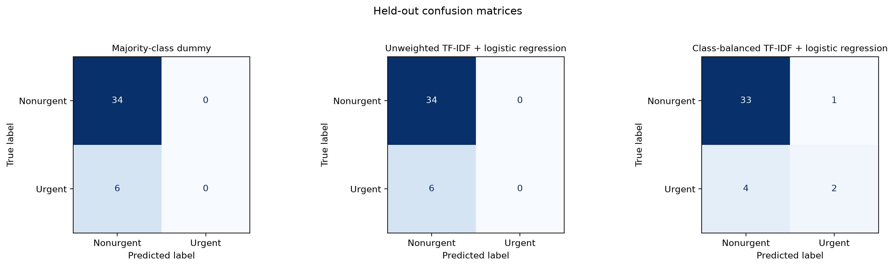

# Explainable AI Email Triage: Model Selection and Baseline

Keith G. Broussard  
University of the Cumberlands  
MSAI 699-B01: Capstone  
Dr. Gamini Bulumulle  
July 19, 2026

## Explainable AI Email Triage: Model Selection and Baseline

The purpose of this stage of the capstone was to select and implement an initial model for classifying email urgency, establish a performance benchmark, and identify areas for improvement. The Enron Email Dataset provides authentic organizational email for this task and has been used in prior email-classification research (Cukierski, 2016; Klimt & Yang, 2004). The current experiment used 199 human-reviewed messages: 169 nonurgent and 30 urgent. Because urgent messages were the minority class, accuracy was considered together with urgent precision, recall, F1-score, and false negatives.

### Model Architecture and Justification

The baseline architecture combines term frequency–inverse document frequency (TF-IDF) features with logistic regression. Subject and body text were combined, converted to lowercase, and represented with unigram and bigram TF-IDF features. English stop words were removed, and terms appearing in fewer than two training messages were excluded. Logistic regression was selected because it is efficient with sparse text features, produces a clear initial benchmark, and provides coefficients that can be inspected as an initial form of model transparency. Beginning with a comparatively simple model also makes later improvements easier to evaluate (Burkov, 2019).

The approved records were divided into an 80/20 stratified train/test split, resulting in 159 training messages and 40 test messages. The test set contained 34 nonurgent and six urgent messages. A fixed random state of 42 made the split reproducible. TF-IDF was fit within the training pipeline to avoid using test-set information during feature construction. The implementation used scikit-learn (Pedregosa et al., 2011).

Three models were compared exploratorily on the fixed holdout. A majority-class dummy classifier established the minimum reference performance. Unweighted logistic regression tested the basic architecture, and balanced class weights gave the smaller urgent class more influence without changing the labels or split. Because the preferred variant was identified from this same holdout, its result is preliminary rather than an untouched final estimate.

### Initial Results

| Model | Accuracy | Urgent Precision | Urgent Recall | Urgent F1 | Urgent False Negatives |
|---|---:|---:|---:|---:|---:|
| Majority-class dummy | 85.0% | 0.0% | 0.0% | 0.0% | 6 |
| Unweighted logistic regression | 85.0% | 0.0% | 0.0% | 0.0% | 6 |
| Class-balanced logistic regression | 87.5% | 66.7% | 33.3% | 44.4% | 4 |

The dummy and unweighted models predicted every test message as nonurgent, making their 85.0% accuracy misleading. The class-balanced model correctly classified 35 of 40 messages: two urgent true positives, one nonurgent false positive, and four urgent false negatives. Thus, urgent recall—not overall accuracy—remains the primary weakness.

The four missed urgent messages included two explicit urgent notifications, a near-term administrative deadline, and an active power outage. Their varied wording shows that the small linear baseline did not consistently generalize urgency across administrative, event, and operational contexts.

The notebook records a bounded evidence table for these false negatives. In summary, the administrative deadline resembled routine correspondence; one explicit urgent request still received insufficient learned weight; the outage depended on operational context without a prominent urgency cue; and an explicit server notification was embedded in forwarded/FYI technical text.

The coefficient review also showed that some plausible terms, such as *asap*, influenced predictions toward urgent. Other influential names, numbers, and company-specific words may reflect the small historical sample rather than general urgency. These terms should be treated as model associations, not proof that a message is urgent.

### Potential Improvements and Conclusion

The class-balanced model is a preliminary Week 3 baseline, not a deployment-ready system. Only six urgent messages were tested, and urgency-enriched sampling does not represent the corpus's natural urgency rate.

Future work should expand the reviewed data, check related-message grouping, reserve untouched evaluation data, and use cross-validation and threshold analysis to improve urgent recall.

## References

Burkov, A. (2019). *The hundred-page machine learning book*. Andriy Burkov.

Cukierski, W. (2016). *Enron email dataset* [Data set]. Kaggle. https://www.kaggle.com/datasets/wcukierski/enron-email-dataset

Klimt, B., & Yang, Y. (2004). The Enron corpus: A new dataset for email classification research. In J.-F. Boulicaut, F. Esposito, F. Giannotti, & D. Pedreschi (Eds.), *Machine learning: ECML 2004* (pp. 217–226). Springer. https://doi.org/10.1007/978-3-540-30115-8_22

Pedregosa, F., Varoquaux, G., Gramfort, A., Michel, V., Thirion, B., Grisel, O., Blondel, M., Prettenhofer, P., Weiss, R., Dubourg, V., Vanderplas, J., Passos, A., Cournapeau, D., Brucher, M., Perrot, M., & Duchesnay, É. (2011). Scikit-learn: Machine learning in Python. *Journal of Machine Learning Research, 12*, 2825–2830. https://jmlr.org/papers/v12/pedregosa11a.html
