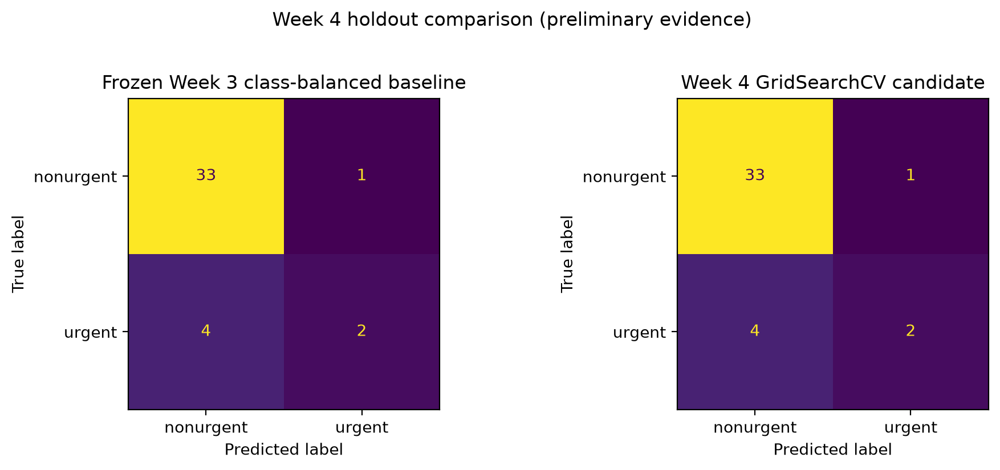
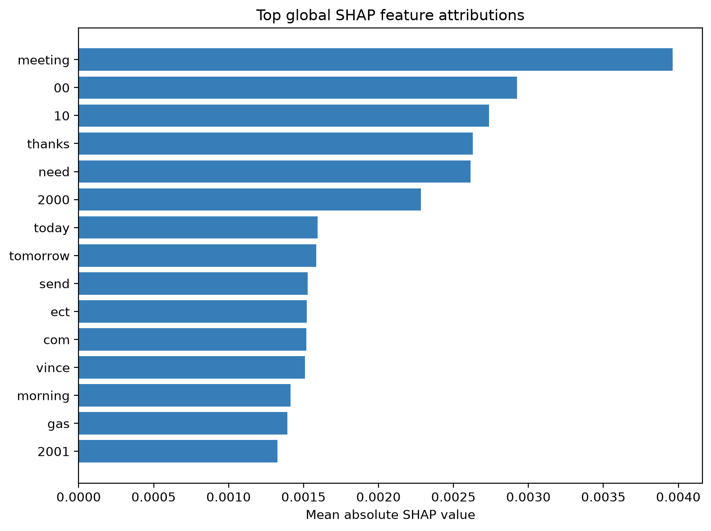

# Week 4 Model Optimization Report

Keith G. Broussard 
University of the Cumberlands 
MSAI 699-B01: Capstone 
Dr. Gamini Bulumulle 
July 24, 2026

> The submission-ready Word version uses a separate title page, three pages of report content, and a separate references page.

## Purpose and Experimental Design

Week 4 required a documented model-improvement experiment, an evaluation of accuracy, precision, recall, and F1-score, at least one explainability method, and an ethical discussion (Course instructor, 2026). I preserved the submitted Week 3 class-balanced TF-IDF and logistic-regression model as the comparison point. The purpose was not to claim that a small historical email sample is ready for automated triage. I wanted to determine whether a bounded, reproducible tuning experiment produced enough evidence to retain a candidate for further refinement.

The reviewed dataset contains 199 messages: 169 nonurgent and 30 urgent. I kept the Week 3 split of 159 training messages and 40 holdout messages. Model selection used five-fold stratified cross-validation on the training partition only. The 40-message holdout had informed the earlier Week 3 exploration, so it remains preliminary comparison evidence rather than an untouched final estimate. This distinction matters: repeatedly selecting models from the same holdout would make the reported result look more certain than the evidence supports.

The experiment evaluated 24 class-balanced TF-IDF/logistic-regression configurations with `GridSearchCV`. The grid varied logistic-regression regularization (`C` = 0.1, 1.0, or 10.0), unigram versus unigram-plus-bigram features, minimum document frequency (1 or 2), and sublinear term frequency. These choices tested both hyperparameter tuning and defensible feature engineering without turning a small project dataset into an open-ended search.

I selected the candidate with urgent-class F1 because accuracy alone can look acceptable while urgent messages are missed (Burkov, 2019). Accuracy, urgent precision, urgent recall, feature count, fit time, and scoring time remained supporting measures. The selected candidate used `C=0.1`, unigram TF-IDF, `min_df=2`, and sublinear term frequency. Several configurations tied on the primary score, so the notebook retains the deterministic `GridSearchCV` winner instead of choosing a result after reviewing holdout outcomes.

## Results and Tradeoffs

In mean five-fold cross-validation, urgent F1 increased from 6.7% for the frozen baseline to 11.4% for the selected candidate. Urgent recall increased from 4.0% to 8.0%, while mean accuracy increased from 83.7% to 86.2%. Mean urgent precision remained 20.0% for both models. The candidate therefore improved the primary model-selection evidence and did so with a smaller feature space.

| Measure | Frozen Week 3 baseline | Week 4 candidate |
| --- | ---: | ---: |
| Mean five-fold CV accuracy | 83.7% | 86.2% |
| Mean five-fold CV urgent precision | 20.0% | 20.0% |
| Mean five-fold CV urgent recall | 4.0% | 8.0% |
| Mean five-fold CV urgent F1 | 6.7% | 11.4% |
| Preliminary holdout accuracy | 87.5% | 87.5% |
| Preliminary holdout urgent precision | 66.7% | 66.7% |
| Preliminary holdout urgent recall | 33.3% | 33.3% |
| Preliminary holdout urgent F1 | 44.4% | 44.4% |
| Preliminary holdout urgent false negatives | 4 | 4 |
| TF-IDF features | 4,097 | 2,895 |

The improvement is useful but not conclusive. The urgent class is small, and the fold-level urgent F1 values varied substantially. The candidate’s cross-validation improvement should therefore be treated as a direction for refinement, not proof of a stable operational gain. A lower feature count is also a modest efficiency benefit: the candidate used 2,895 features instead of 4,097 and had lower single-run fit and scoring times. On a 199-message dataset, those times are lightweight indicators rather than deployment benchmarks.

The preliminary holdout did not improve. Both models correctly classified 33 nonurgent messages and two urgent messages, produced one false positive, and missed four urgent messages. Figure 1 makes the limitation visible: the candidate did not regress on the preserved comparison, but it did not reduce the central safety concern either. The same candidate may be worth retaining because selection occurred from cross-validation rather than the holdout, but further work must target urgent recall and false negatives directly.

## Explainability, Error Analysis, and Ethical Decision

I implemented SHAP for both global and local explanation. The notebook includes a global feature-attribution chart plus local explanations for a correct urgent prediction, an urgent false negative, and a false positive. Figure 2 shows terms such as *meeting*, *need*, *today*, and *tomorrow* among the more influential global features. They are learned associations in this model, not proof that any message is urgent. Names, dates, numbers, and organization-specific terms can reflect the small historical sample instead of a reusable urgency rule. Explainability is useful for inspection and error analysis, but it does not establish causation, fairness, or generalizability (Keita, 2023).

The error review found four urgent false negatives and one false positive in the preliminary holdout. The missed urgent messages covered deadline or administrative requests, operational outage context, technical or forwarded notices, and explicit urgency with a deadline. That range matters because it shows that the remaining misses are not one simple vocabulary problem. A normalized-text check found zero exact duplicate pairs crossing the training and holdout boundary. This reduces one leakage risk, but it cannot identify near duplicates, reply chains, or related messages.

Privacy, fairness, and human oversight remain central limits. The repository excludes raw email bodies from Git, and this report uses aggregate metrics, feature terms, and error categories rather than message text. The label manifest has no reliable protected demographic attributes, so I cannot calculate or claim demographic fairness. The urgency-enriched sample also does not estimate the natural urgency rate in the broader Enron corpus. A false negative could delay human attention to a message, while a false positive creates additional review work; neither outcome justifies automatic email action.

Because the prior holdout is preliminary and retains four urgent false negatives, I retained the Week 4 candidate for refinement, not deployment. The next step is to expand the reviewed labels, account for related messages during validation, and examine threshold tradeoffs using newly held out evaluation data. Until then, the classifier should remain decision support for a human reviewer. That recommendation is consistent with the Week 4 requirement to weigh model improvement against accuracy, efficiency, fairness, and ethical risk.

## References

Burkov, A. (2019). *The hundred-page machine learning book*. Andriy Burkov.

Course instructor. (2026). *Week 4 model optimization report assignment* [Course assignment]. MSAI-699 Capstone.

Keita, Z. (2023, May 10). *Explainable AI: Understanding and trusting machine learning models*. DataCamp. https://www.datacamp.com/tutorial/explainable-ai-understanding-and-trusting-machine-learning-models
